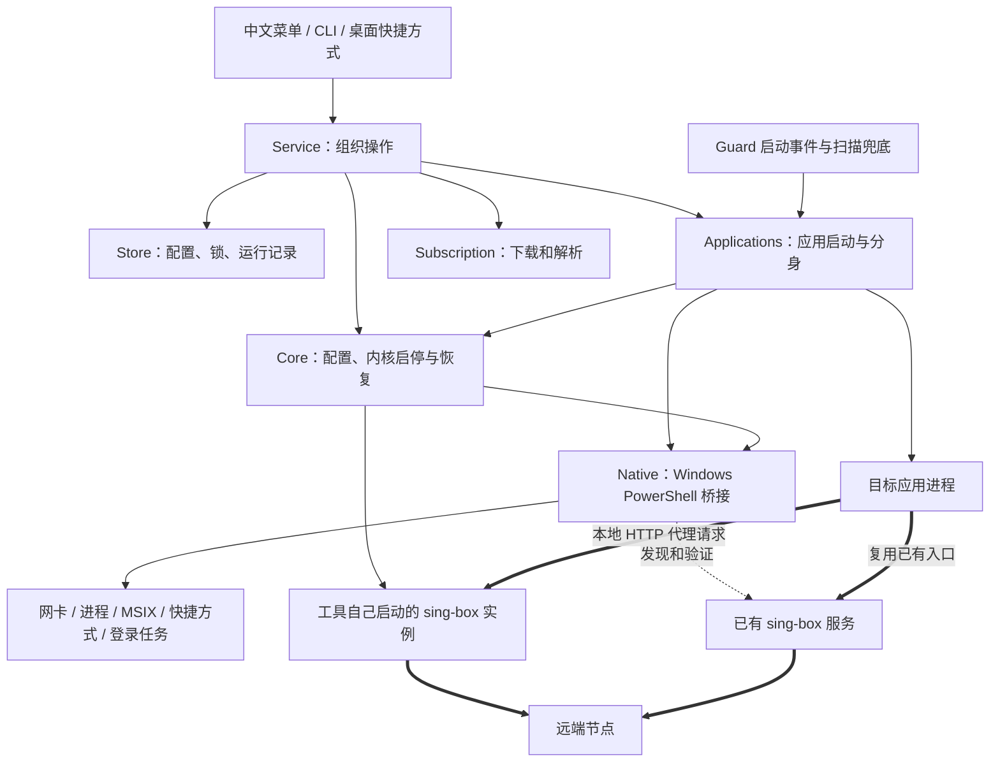
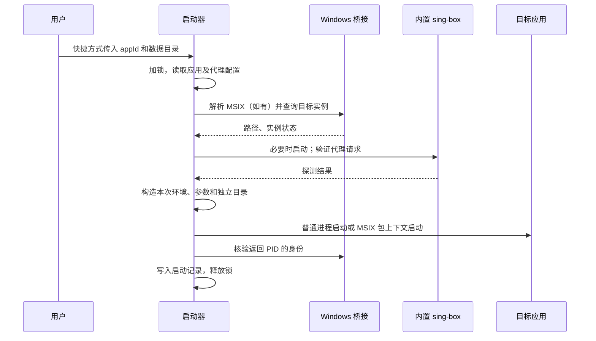

# Windows App Proxy：设计与实现

版本：0.2 · 更新日期：2026-09-18

本文按当前 Windows 源码说明已经实现的行为。旧《实现计划》《实现交接》保留了早期方案；理解现有实现时，以本文和 [使用说明](D:/app_proxy/windows/README.md) 为准。测试结论引用 [验证记录](D:/app_proxy/windows/TEST-RESULTS.md)，不把代码设计等同于实际验证。

## 1. 先看一条完整链路

这个工具做两件事：**启动应用时告诉它使用哪个本地代理端口；复用已有 sing-box 服务，或使用已有程序启动工具自己的配置。找不到程序时再协助安装。**

例如，给 Codex 分身绑定“美国出口”后：

```text
桌面快捷方式
    → App Proxy 启动器
    → 验证已有 sing-box 服务，或启动自建实例
    → 带代理参数和独立目录启动 Codex

Codex 的代理请求
    → 127.0.0.1:18099
    → sing-box 的对应入口
    → 该入口的节点选择组
    → 自动选出的 Wi-Fi / 以太网
    → 远端代理节点
    → 目标服务
```

其中 `18099` 是示例端口，每个代理配置可以使用不同端口。网卡决定“从本机哪条网络出去”，代理节点决定“由哪个远端出口访问目标”。两者是不同层次。

工具本身没有开启 TUN，也没有在 Windows 全局按进程截获流量。应用必须支持代理参数或代理环境变量，才能通过这个入口发请求；不遵循它们的网络库不会自动被接管。

## 2. 总体架构：管理逻辑与转发逻辑分开



细线表示配置、启动和查询，粗线表示实际流量。Node.js 不替应用转发每个网络包；实际代理协议、连接和节点测速由 sing-box 完成。

| 部分 | 当前实现 | 这样划分的作用 |
|---|---|---|
| 菜单与业务逻辑 | TypeScript，由 Node.js 24 直接运行 | 复用原 mac 版 JavaScript 订阅逻辑，集中处理状态和流程 |
| Windows 接口 | 系统 PowerShell 5.1，少量内嵌 C# 用于命令行解析 | 使用系统现有的进程、网卡、COM 和包管理接口 |
| 代理内核 | 优先已有 sing-box；随包/下载 1.14.1 x64 作为缺失时的选择 | 独立程序，实际执行 version/check 验证 |
| 隐藏启动 | WScript + `hidden.vbs` | 双击快捷方式和登录启动 Guard 时隐藏控制台 |
| 数据 | 本地 JSON 文件、实例目录 | 无需数据库服务，便于检查、备份和定位问题 |

CLI 通常随一··菜单不会停止已有代理连接。当前没有 Windows 服务、托盘或桌面 GUI。

## 3. 三个核心对象：应用、代理配置、节点

对应 [类型定义](D:/app_proxy/windows/src/types.ts)。

| 对象 | 关键内容 | 例子 |
|---|---|---|
| `App` 应用登记 | EXE、参数、工作目录、适配器、`profileId`、Guard 开关、分身类型 | “Codex 美国分身” |
| `Profile` 代理配置 | 本地端口、节点列表、订阅来源 | “美国出口”，端口 18099 |
| `NodeSpec` 节点 | 协议、服务器、端口、认证字段、是否选中 | 一个 AnyTLS 服务器 |

关联关系是：`App.profileId → Profile.id → Profile.nodes`。

多个应用可以绑定同一个 Profile，共享本地端口。工具自己的 managed 配置由**同一个 sing-box 进程**承载，网卡选择是该实例的全局设置；复用的已有服务各自由原启动器管理，不纳入本工具生成的配置。

因此，“美国出口”和“日本出口”可以同时存在，但它们不必启动两份内核，也不是分别使用一张网卡。修改任一配置需要重启这一个内核，其他入口的连接也可能短暂中断。

Profile 接受 `kind: managed`（自己的节点/订阅配置）和 `kind: sing-box`（已有本机服务入口，节点列表为空）。发现服务通过 TCP 监听端口核对 sing-box 进程，执行 version 和真实代理请求，再保存地址；应用启动时重新验证。已有服务不导入配置、不启动或停止进程，不恢复通用 external 类型或其旧数据兼容。

## 4. 订阅怎样变成 sing-box 配置

实现入口：[subscription.ts](D:/app_proxy/windows/src/subscription.ts)、[迁移脚本](D:/app_proxy/windows/scripts/migrate-legacy.ts)、[配置生成器](D:/app_proxy/windows/src/legacy/config.js)。

```text
订阅 URL
  → 使用不同客户端 User-Agent 尝试下载
  → 解析为统一 NodeSpec 列表
  → 按地区展示，由用户选择节点
  → 保存 Profile
  → 生成 sing-box JSON
  → sing-box check
  → 启动并验证真实代理请求
```

**订阅解析在工具里完成。** 当前没有把 Clash YAML 等订阅直接交给 sing-box。工具迁移了 mac 版 JXA 的解析算法，替换文件读写、Base64 等平台依赖，并修复块状 ALPN 列表被误当节点的问题。

支持范围包括原解析器覆盖的 Clash YAML、部分客户端文本配置、URI 和 Base64 节点列表；协议包括 AnyTLS、VLESS、VMess、Shadowsocks、Trojan、Hysteria2。手动上游入口另支持 HTTP/SOCKS5。

下载依次尝试 Clash.Meta、Loon、Quantumult X 等标识，每次有超时和响应大小限制。拿到第一次成功的响应后进入解析；解析失败不会自动继续换 User-Agent 下载。它也不是通用 YAML 或任意 sing-box JSON 导入器。

### 每个 Profile 如何生成路由

假设 Profile A 选了节点 A1、A2，生成内容在概念上是：

```text
HTTP inbound：127.0.0.1:18099，tag=A-in
    → route：A-in 对应 A-auto
    → urltest：A-auto，候选 A1、A2
    → 具体节点 outbound：协议、服务器和认证字段
```

即使只选一个节点，也沿用同一套节点组结构。工具决定组内有哪些节点，sing-box 决定组内当前使用哪个节点。路由按入口区分不同 Profile，末尾有 `reject` 规则，未匹配的入站流量不会自动借用其他 Profile 的出口。

这里有两种探测：工具的健康探测用于决定启动/配置更新是否成功；sing-box 的 `urltest` 用于组内节点选择。当前前者可通过 `settings.testUrl` 修改，后者仍沿用生成器内的固定 URL 和测速参数，二者不是同一个设置。

### 刷新订阅

刷新以节点名称对齐新旧数据，保留仍存在的选择，报告新增节点数量和已选节点的移除情况。出现重名，或更新会清空所有已选出口时，拒绝提交，保留旧配置。当前是手动刷新，没有定时任务。

## 5. 自动选择网卡，怎样尽量避开其他 TUN

实现入口：[network.ts](D:/app_proxy/windows/src/network.ts)、[bridge.ps1](D:/app_proxy/windows/native/bridge.ps1)、[core.ts](D:/app_proxy/windows/src/core.ts)。

mac 版的思路是优先找到可联网的 Wi-Fi，其次是其他物理网卡，失败后回退到 sing-box 自动路由。Windows 保留这个顺序，用 Windows 网卡属性筛选，并通过真实代理请求验收。

1. PowerShell 读取网卡、IPv4 地址、默认路由和接口 metric。
2. 只保留已连接、硬件属性为物理、非虚拟、有可用 IPv4 地址和默认路由的候选；额外按名称排除 TUN/TAP、VPN、回环、蓝牙等。
3. Wi-Fi 优先；同类候选按“路由 metric + 接口 metric”从小到大排序，再用接口索引稳定排序。
4. 为候选生成 `route.default_interface`，启动自己的实例：应用冷启动验证所绑定的出口；修改节点验证被修改的配置；通用启动要求至少一个自建出口成功。已有服务不参加网卡配置。
5. 若启动或联网验证失败，停止这次内核并尝试下一候选。候选全部失败后，改为 `route.auto_detect_interface: true` 再尝试一次。
6. 成功后在 `runtime.upstream` 记录模式、网卡、验证时间或回退原因；全失败则报错。

配置中二者互斥，例如：

```json
{"route":{"default_interface":"以太网"}}
```

回退时换成：

```json
{"route":{"auto_detect_interface":true}}
```

以上是字段示意，不是完整配置。网卡名通过 JSON 传递，支持中文和空格，不拼进 shell 命令。

**自动选择发生在实际启动、重启或配置应用时。** 对已在运行的内置内核调用普通 `start` 会复用进程，不重新探测；目前没有常驻网络变化监听器。切换 Wi-Fi/以太网后，可用“重启并重新探测网卡”。

这项功能约束 sing-box 的出站选路。回退到自动路由后，仍可能使用虚拟网卡，状态页会说明；它不承诺绕过其他软件的 WFP/防火墙强制规则。当前筛选依赖 IPv4，纯 IPv6 物理网络不在这一轮优先候选范围内。

### DNS 和订阅下载是否也绑定了

内核配置使用 DoH，自定义服务器排在首位，域名解析策略为 IPv4-only；DoH 服务器自身的域名由系统本地 DNS 引导解析。预置多个 DoH 定义不代表实现了自动故障切换。

订阅下载由 Node.js `fetch` 发起，系统 DNS 引导解析也有自己的路径。因此，不能根据内核绑定成功，就认定工具自身每个请求和全部 DNS 都绕开了其他代理。

## 6. 双击快捷方式后发生什么

实现入口：[integration.ts](D:/app_proxy/windows/src/integration.ts)、[applications.ts](D:/app_proxy/windows/src/applications.ts)。



快捷方式实际运行 `wscript.exe → hidden.vbs → Node → cli.ts launch <appId>`，不把节点密码或订阅地址写进快捷方式。

启动前若发现目标主进程或同一实例的辅助进程仍在运行，就拒绝再次启动。很多桌面程序会把第二次启动转交给旧进程，新传入的代理参数不会让旧进程重新联网。

| 适配方式 | 启动器设置什么 | 适用边界 |
|---|---|---|
| `environment` | 本次子进程的 `HTTP_PROXY`、`HTTPS_PROXY`、`ALL_PROXY`，以及空的 `NO_PROXY` | 应用网络库必须读取这些变量 |
| `chromium` | 上述变量，加 `--proxy-server=http://127.0.0.1:端口` | 应用需支持 Chromium/Electron 代理参数 |
| 直连 | 移除继承的代理变量；Chromium 额外设置 `--no-proxy-server` | 仍不覆盖应用自带配置或所有系统网络行为 |

环境变量按 Windows 大小写不敏感规则处理，只作用于本次启动。启动器不修改用户持久环境变量或 Windows 系统代理。

## 7. Codex / Claude 分身与 MSIX：两层问题分别处理

不需要分身时，选择普通应用模式（省略 `instance`）：只注入代理，不指定新的用户数据目录，也不创建类型专属 home。当前运行的原版须先退出再通过工具启动；Guard 可单独纠正原版误启动。Claude 2.2553.1.0 已实测原版目录沿用、网络进程连接内置代理、重复启动拒绝及 Guard 纠正，既有分身进程保持不变。验证未涉及登录和模型对话。

### 分身解决独立数据目录

分身类型由 `instance: codex` 或 `instance: claude` 指定，按应用 ID 创建：

```text
%LOCALAPPDATA%\AppProxy\instances\<appId>\
  user-data\     Electron 用户数据
  codex-home\    仅 Codex 分身创建
  claude-home\   仅 Claude 分身创建
```

以上是普通应用及关闭 AppData 文件虚拟化的 MSIX 的位置。启用虚拟化的包自动使用 `%LOCALAPPDATA%\Packages\<包家族>\LocalState\AppProxy\<工具目录摘要>\instances\<appId>`，并在同一根目录下交换启动请求和回执。由包清单决定，非 Claude 特判；已分配的目录在后续包升级时保留。本机 Claude 需要该处理，Codex 继续使用原目录。Windows 卸载或重置原应用包可能清除 LocalState 中的分身数据。

两种分身均设置 `--user-data-dir`。Codex 额外设置 `CODEX_ELECTRON_USER_DATA_PATH` 和 `CODEX_HOME`；Claude 则设置 `CLAUDE_CONFIG_DIR`。启动时清除继承的这些目录变量，再写入当前类型的值，避免串用另一个实例的目录。两种分身共用启动器、代理和 Guard，不复制原实例登录文件，不允许用户附加参数覆盖分身目录。

工具只创建空目录和设置子进程环境，不读写 Claude settings。`CLAUDE_CONFIG_DIR` 是 Claude Code 的配置目录变量，能重定向遵循该变量的组件；Desktop 内部是否继承和采用，需要实际版本验证。当前没有改 Windows 用户目录、复制凭据或处理 Cowork 虚拟机资源。[官方变量说明](https://code.claude.com/docs/en/env-vars)

进程归属根据 EXE 和 `--user-data-dir` 判断。辅助进程缺少目录参数时，只沿已观察到的同 EXE 父进程链推断归属。因此，原实例和其他分身不会仅因 EXE 同名就被一起操作。

这是应用数据分离；各实例仍是同一个 Windows 用户，可能共享系统或包级凭据设施，不构成安全沙箱。

### MSIX 解决正确的包上下文启动

实现入口：[msix.ts](D:/app_proxy/windows/src/msix.ts)、[msix-child.ts](D:/app_proxy/windows/src/msix-child.ts)。

MSIX 识别和启动是通用逻辑，没有硬编码 Codex 或 Claude 包名。用户提供 EXE 后，若路径包含 `WindowsApps`，启动器查询当前用户的包清单与 manifest，匹配 EXE 并保存包家族和应用 ID；已经保存包身份的应用随后直接按身份查询。当前没有扫描并展示全部 MSIX 应用的选择界面，其他位置且尚无包身份的 EXE 仍按普通程序处理。应用专用的部分是上一节的分身目录和环境变量，这条包启动通道由两种分身共用。

此前实测 Codex 安装在 `WindowsApps` 下，从普通 Node 进程直接执行包内 EXE 得到 `EPERM`。当前路径由 Windows 根据已登记的包身份启动辅助进程，再启动目标：

```text
根据 PackageFamilyName + AppId 查当前安装路径
  → 写入受限数据目录中的一次性启动请求
  → Invoke-CommandInDesktopPackage -PreventBreakaway
  → 包上下文中的 Node 辅助进程
  → 设置这次代理和分身环境变量
  → spawn 真正的应用 EXE
  → 原子写入 PID / 错误回执
  → 主启动器核验身份并登记
```

请求不通过命令行携带完整配置。每次使用唯一文件名和 20 秒期限，辅助进程拒绝过期请求；主进程保留待确认记录，超时后不立即重复启动，避免延迟激活造成双重实例。

真实 Claude 暴露了包内外 AppData 视图不同的问题：辅助进程读不到工具的请求文件，导致无回执超时。`msix-storage.ts` 根据 manifest 中 `desktop6:FileSystemWriteVirtualization` 是否明确为 `disabled`，为需要隔离存储的包分配 LocalState 子目录；只给工具专属子目录设置用户/SYSTEM ACL。该目录实测包内外均可读写。未改变包的虚拟化设置。[微软 MSIX 存储说明](https://learn.microsoft.com/en-us/windows/msix/msix-troubleshooting-guide)

包路径在启动时重新解析，避免将版本号路径永远写死。当前仅接受已登记的 `Windows.FullTrustApplication` 桌面应用；没有更改应用包、ACL 或签名。实际应用升级后的兼容性仍需要验收。

## 8. Guard 怎样纠正误启动

实现入口：[guard.ts](D:/app_proxy/windows/src/guard.ts)。

菜单和 CLI 新增应用统一经 `Service.addApp`：确认 Chromium 适配的 Codex.exe / Claude.exe（按 EXE 名而非显示名判断）和显式 Codex/Claude 分身，绑定代理后默认启用 Guard，调用既有授权和启动流程。环境变量适配的 CLI、直连及其他应用不自动开启；JSON 可用 `guard:false` 覆盖，菜单也可停用。取消授权时保留应用登记并明确提示保护未完成，不自动重试 UAC，不批量迁移已有应用。

Guard 是用户显式启用的后台 Node 进程，配有当前用户登录任务。启动时扫描已有目标；通过独立 PowerShell/C# 辅助进程直接消费 `Microsoft-Windows-Kernel-Process` 的 ETW ProcessStart 事件（关键字 `0x10`、事件 ID 1），避免通知被同步原生桥阻塞。TDH 按 `ProcessID`、`SessionID`、`ImageName` 字段名解析，不依赖版本相关的 payload 偏移。收到已登记 EXE 的启动通知后合并检查请求，查询并核验真实路径、参数和身份，所有纠正串行执行。事件本身的 PID/名称不作为终止进程的凭据。[微软实时消费说明](https://learn.microsoft.com/en-us/windows/win32/api/evntrace/ns-evntrace-event_trace_logfilew)

事件模式每 30 秒完整扫描补漏，配置每 2 秒读取以响应新增或停用保护。监听统一走管理员辅助进程，普通权限监听路径已删除。启用保护或前台启动 Guard 时先完成授权；取消 UAC 不修改原应用保护配置。已有后台若失去授权、监听失败或中断，则临时退回约每 2 秒扫描，每 30 秒重试连接，日志记录实际模式，后台不会弹 UAC。

菜单“6 Guard → 1 启用应用保护”和 CLI `guard enable` 自动通过一次 UAC 安装固定的 `elevated-events.ps1` 副本到 Program Files，ACL 和所有者限制普通用户写入。UAC 在配置锁外完成，成功后重新核对应用配置再保存、刷新 Guard。计划任务使用当前用户交互令牌及最高权限，只运行这个固定脚本；普通用户仅有读取和运行任务的权限，不能改动作。任务按需启动，没有第二个登录触发器：普通 Guard 登录任务负责重启后拉起 Guard，Guard 再调用已授权任务。正在运行的旧 Guard 会在启用保护时更新为当前版本，原应用不因这一步继承管理员权限。“3 修复监听授权”仍可手动修复或更新。

监听端通过按用户 SID、配置命名空间、会话区分的本地命名管道发送进程通知；管道 ACL 限制当前用户和管理员，并拒绝网络身份。客户端数据不被解析为命令，管理员端不读取应用配置、不启动或终止目标应用。Guard 收到通知后仍自行核验真实进程。连接关闭后监听退出，Guard 下次连接可按需重启，无需再次授权。撤销授权或全部卸载会经 UAC 删除对应任务与固定脚本；监听代码更新也必须显式授权。后台重连不会触发 UAC。

ETW 创建按用户 SID 和配置命名空间隔离的固定名称会话，配有确定的归属 GUID；不操作其他软件的追踪会话。使用 16KB 缓冲、4–16 个缓冲区及禁用按 CPU 分配缓冲的模式，仅实时消费，不保存 ETL。Windows 自带刷新定时器最小 1 秒，所以监听线程每约 100ms 调用 `ControlTrace(FLUSH)` 投递已生成的事件；这不扫描进程列表。错误、解码失败或事件丢失触发扫描降级。监听退出关闭 consumer 并停止自己的 session；强制结束后的残留会话由下次启动或升级/撤销授权按名称及 GUID 回收。[刷新定时器](https://learn.microsoft.com/en-us/windows/win32/api/evntrace/ns-evntrace-event_trace_properties)、[ControlTrace](https://learn.microsoft.com/en-us/windows/win32/api/evntrace/nf-evntrace-controltracew)

真实提权测试验证普通进程可以调用已授权任务、收到通知，且不能写入管理员脚本；任务的普通用户 ACE 仅有读/执行权限。ETW 两轮各 8 个进程的请求启动至通知分别为 12–117ms、17–132ms，旧 WMI 基线为 1304–1999ms；32 个短进程全部收到。10 秒采样的监听进程 CPU 时间约 47ms（约单核 0.47%，不是整个系统开销）。已验证断开重连、强制结束后的残留会话恢复，以及撤销任务后没有 ETW 残留。采样未运行 Guard 纠正循环，不代表应用重启完成时间或延迟上限；未执行重启电脑验收。证据及历史 WMI 分析见 `windows/TEST-RESULTS.md`。

扫描期间不持有配置锁：先读取配置快照、查询包和进程，再短暂持锁比较当前配置是否仍与快照相同；若用户在扫描期间修改了绑定或关闭保护，就丢弃本轮结果。真正纠正仍在锁内，并重新验证进程身份。已有完整配置的 Store 初始化也不再无条件获取写锁，减少桌面启动等待。

进程归属从逐个 WMI GetOwnerSid 改为读取 Windows 进程令牌中的用户 SID，并比较 GetProcessTimes 创建时间与 CIM 快照，拒绝 PID 已复用的情况。同机 34 个相关进程的查询从 9.692 秒降至 0.287 秒；一次包外 Claude 分身桌面启动观测为约 3.7 秒出现进程、4.0 秒出现窗口。网络健康检查仍保留，窗口耗时不是固定保证。[微软进程归属查询说明](https://learn.microsoft.com/en-us/windows/win32/procthread/process-enumeration)

```text
找到受保护实例的主进程
  → 参数是否已可读？否则有限重试，不做纠正
  → 代理参数是否符合预期？是则保留
  → 是否为工具已记录、仍使用旧绑定的同一个实例？是则保留
  → 检查冷却和重试次数
  → 核验身份，尝试正常关闭
  → 必要时再次核验后终止
  → 同实例辅助进程尚未退出则报错
  → 复用正常应用启动流程，带代理重新启动
```

取消固定 1.2 秒启动宽限；事件对应进程尚未查到或参数不可读时，按 100、200、300 毫秒间隔最多追加三次查询，之后交给扫描补漏。纠正操作间隔仍至少 5 秒，每个应用每分钟最多 3 次。终止前检查 PID、创建时间、EXE、当前用户及交互会话，并持有进程句柄，降低 PID 复用导致误操作的风险；不按 EXE 名称批量结束进程。

Guard 只纠正启用保护的目标。它不是流量阻断器，启动事件发生时进程已经创建，纠正前仍存在直连时间窗口，也不是持续检测 sing-box 健康并自动修复的服务看门狗。误启动后的重启可能影响该实例未保存的工作。

改变应用绑定后，工具已启动的旧实例保留原绑定，下一次启动使用新绑定，避免仅因改设置就被 Guard 关闭。

## 9. 配置更新与失败恢复

实现入口：[Core.applyUnlocked](D:/app_proxy/windows/src/core.ts)、[Store](D:/app_proxy/windows/src/store.ts)。

更新配置时，先生成候选并执行真实 `sing-box check`，成功后保存旧 manifest 和旧内核配置到 `config/backup.json`。如果内核原本运行，再停止旧进程，按网卡候选启动新配置；节点或端口改变时验证被修改的配置，通过才提交新 manifest。应用冷启动验证它绑定的出口，直接启动/重启内核要求至少一个出口可用，避免无关的失效出口阻止正常应用使用。启动应用前仍会对其绑定代理执行真实请求。

| 失败位置 | 当前处理 |
|---|---|
| 参数、订阅或配置检查失败 | 不停止旧内核，不提交新配置 |
| 端口被其他进程占用 | 报错，不结束占用端口的外部进程 |
| 候选网卡启动/联网失败 | 清理本次内核，尝试下一网卡或自动路由 |
| 更新后的配置无法工作 | 恢复旧配置、manifest 和上游记录，尝试重新启动旧配置 |
| 旧配置也无法启动 | 明确报告恢复失败，保留配置供诊断 |

这是常规异常恢复，不是覆盖断电、进程被强杀等所有情况的完整事务系统。配置更新会重启共享内核，也不保证已经建立的连接不中断。

多个 CLI、快捷方式和 Guard 共用数据目录锁。原生辅助进程以 FileShare.None 打开 `state/config.lock`，持有独占句柄直到操作结束；持有进程退出后由 Windows 自动释放，不再手动回收 PID 锁目录。每次获取生成独立 token，释放时校验所属请求。写 JSON 采用临时文件加重命名，减少半写文件。方法名中的 `Unlocked` 表示调用者应已持锁，不是“不需要并发保护”。

工具如果从 MSIX 包进程中运行，逻辑 AppData 路径可能指向包内文件；桌面启动器在包外会读到另一份配置。Store 初始化必须通过 manifest 文件句柄解析物理目录（不能只解析父目录），之后状态、锁和外部入口统一使用物理路径。原命名空间保存于 `.store-scope.json`，使路径解析变化不会重置已有分身数据位置或 Guard 任务名称；运行实例识别保留旧逻辑路径别名。本机已通过无包身份进程执行真实 Claude 桌面 .lnk 验证这条边界；对应回归将测试总数增加至 22 项，全部通过。

## 10. 文件布局与 Windows 桥接

程序目录和用户数据分开：

默认入口将实际数据目录记录在 `%USERPROFILE%\.app-proxy-home.json`。后续菜单和 CLI 优先读取这份包内外共享的路径记录；显式 `--home` 或 `APP_PROXY_HOME` 不修改默认记录。Guard 逐个解析 MSIX 登记，一个应用不可用只记录并跳过该项，其他应用继续检查。

```text
工具目录（源码 windows/ 或某个解压后的 release）
  App Proxy.cmd
  src/                         TypeScript 与迁移的 JavaScript
  native/                      PowerShell / VBS
  runtime/node.exe             便携包中的 Node
  runtime/sing-box/            固定内核、DLL、许可证与源码链接

%LOCALAPPDATA%\AppProxy\        可由 --home / APP_PROXY_HOME 指定
  manifest.json                应用、代理、订阅与设置
  config/candidate.json        最近生成的候选配置
  config/sing-box.json         内核运行配置
  config/backup.json           最近一次更新前的配套备份
  state/runtime.json          内核、Guard、应用启动身份与网卡结果
  state/msix-*.json           MSIX 临时请求/回执/待确认记录
  instances/<appId>/          分身数据
  logs/events.log             脱敏事件日志
```

新数据目录限制为当前用户和 SYSTEM 访问，并检查路径边界和重解析路径。节点凭据仍以明文保存在本地受限文件中；不是加密凭据库。状态摘要隐藏订阅 URL、密码和应用参数，内核原始流量日志默认关闭。

[native.ts](D:/app_proxy/windows/src/native.ts) 启动一个 PowerShell 辅助进程，通过标准输入/输出交换按行 JSON。请求带序号，回应带成功标记和结果，单次调用有 30 秒超时。桥接集中负责网卡枚举、进程身份、任务计划、快捷方式、ACL 和 MSIX，不把这些细节散落在菜单代码中。

快捷方式和 Guard 登录任务记录工具的实际位置。删除某个解压目录前，应确认它没有被运行中的进程、快捷方式或任务引用；已有入口不会因复制了新 release 就自动迁移。

## 11. 程序发现、安装、打包和卸载

实现入口：[builtin.ts](D:/app_proxy/windows/src/builtin.ts)、[setup-core.ts](D:/app_proxy/windows/scripts/setup-core.ts)、[package.ts](D:/app_proxy/windows/scripts/package.ts)。

已有可用服务直接使用；需要自建配置时，先查 PATH、运行中的 sing-box 程序及 Scoop/WinGet 常见入口，支持显式 core use 指定程序。已有程序执行 version 验证，配置实际执行 check，不强制固定版本。未发现程序时使用之前下载或随包副本；都不存在则由 install-core.ts 下载固定官方 ZIP、校验归档及 EXE/DLL 哈希后安装到数据目录 bin。已有程序与服务配置不会被安装流程覆盖。

便携包附带 Node，用户不用安装开发依赖或自行下载内核。目前没有版本选择、自动更新或升级/降级机制。每次打包生成独立时间戳目录、ZIP 和 ZIP 校验文件，不覆盖已有 release；打包脚本只复制指定程序目录，不包含用户订阅、分身或测试数据。

卸载按实例归属清理：删除应用登记会撤销其 Guard 和工具快捷方式；清理内核仅停止工具记录的自建实例并关闭依赖它的 Guard，已有服务的 Guard 保留；全部清理撤销工具任务并清空登记。已有服务的进程、配置，以及所有 sing-box 程序、应用本体、分身数据和备份均保留。

## 12. 怎样判断“真的生效”

| 观察结果 | 能说明什么 | 不能据此推出什么 |
|---|---|---|
| `sing-box check` 通过 | 配置可被该内核接受 | 节点一定能联网 |
| 本地 TCP 端口可连接 | 有程序监听 | 它一定是可用代理 |
| 通过入口完成 HTTPS 请求 | 此次代理链路工作 | 目标应用已采用这条链路 |
| `doctor` 返回出口 IP | 工具发起的该次请求走到对应出口 | 目标应用所有网络都走该出口 |
| 应用参数/环境正确 | 代理设置已传给这次进程 | 所有内部网络库都使用它 |
| 目标应用自身请求的连接与出口证据 | 该次目标请求确实经过代理 | 未测试协议、子进程和模型对话同样有效 |

`doctor` 将健康探测与出口查询分开：出口查询站不可达时，可能仍报告代理健康，并单独说明出口探测失败。

截至 2026-09-18 的已记录验收：TypeScript 检查通过，最新 30 项测试全部通过；覆盖真实内核 HTTP/HTTPS、多入口、配置恢复、订阅、网卡筛选及失败回退、启动参数、Guard、实例归属、配置类型校验和 MSIX 辅助程序。受控 EXE 已验证两个 Claude 类型分身、一个 Codex 类型分身和原实例共存，Claude Guard 只纠正目标分身；两种分身分别验证 MSIX 环境传递。非 Codex 包名的受控登记测试验证了通用识别和路径刷新。实际 Codex MSIX 26.911.7940.0 已验证双开、独立目录、浏览器请求代理及 Guard 纠正。

当前订阅曾实测自动选中“以太网”，健康请求成功、出口符合预期。Claude MSIX 2.2553.1.0 已实测双开、独立目录、网络进程连接内置代理及 Guard 仅纠正该分身；该版本拒绝远程调试参数，因此没有 CDP 出口正文证据。其他 TUN 同时启用、运行中网络自动切换、登录后的模型对话、Code/Cowork 及真实应用升级，尚未完成对应验收。真实 Codex 网络证据仍来自此前验收，没有重做其目标应用流量测试。

## 13. 阅读源码的建议顺序

| 顺序 | 文件 | 带着什么问题读 |
|---|---|---|
| 1 | [types.ts](D:/app_proxy/windows/src/types.ts) | 应用、Profile、节点怎么关联？ |
| 2 | [cli.ts](D:/app_proxy/windows/src/cli.ts)、[service.ts](D:/app_proxy/windows/src/service.ts) | 菜单操作最终调用哪些服务？ |
| 3 | [core.ts](D:/app_proxy/windows/src/core.ts) | 配置检查、启动、探测、更新和恢复如何串起来？ |
| 4 | [network.ts](D:/app_proxy/windows/src/network.ts) | 怎样选物理网卡，何时回退？ |
| 5 | [applications.ts](D:/app_proxy/windows/src/applications.ts) | 应用怎样拿到代理参数，怎样区分分身？ |
| 6 | [msix.ts](D:/app_proxy/windows/src/msix.ts)、[msix-child.ts](D:/app_proxy/windows/src/msix-child.ts) | 包上下文和一次性回执怎么配合？ |
| 7 | [guard.ts](D:/app_proxy/windows/src/guard.ts) | 怎样识别和纠正误启动而不碰其他实例？ |
| 8 | [subscription.ts](D:/app_proxy/windows/src/subscription.ts)、[legacy/config.js](D:/app_proxy/windows/src/legacy/config.js) | 订阅怎样变成入口、节点组和出站？ |
| 9 | [store.ts](D:/app_proxy/windows/src/store.ts)、[bridge.ps1](D:/app_proxy/windows/native/bridge.ps1) | 并发、持久化和 Windows 原生能力怎么实现？ |

原版生成器还保留了一些历史能力，例如额外路由或 relay 相关分支。是否属于当前 Windows 功能，要看 `Core.generate` 实际传入的字段、CLI 暴露的操作和对应验收，不能仅凭迁移文件中存在某个函数就认定已支持。
