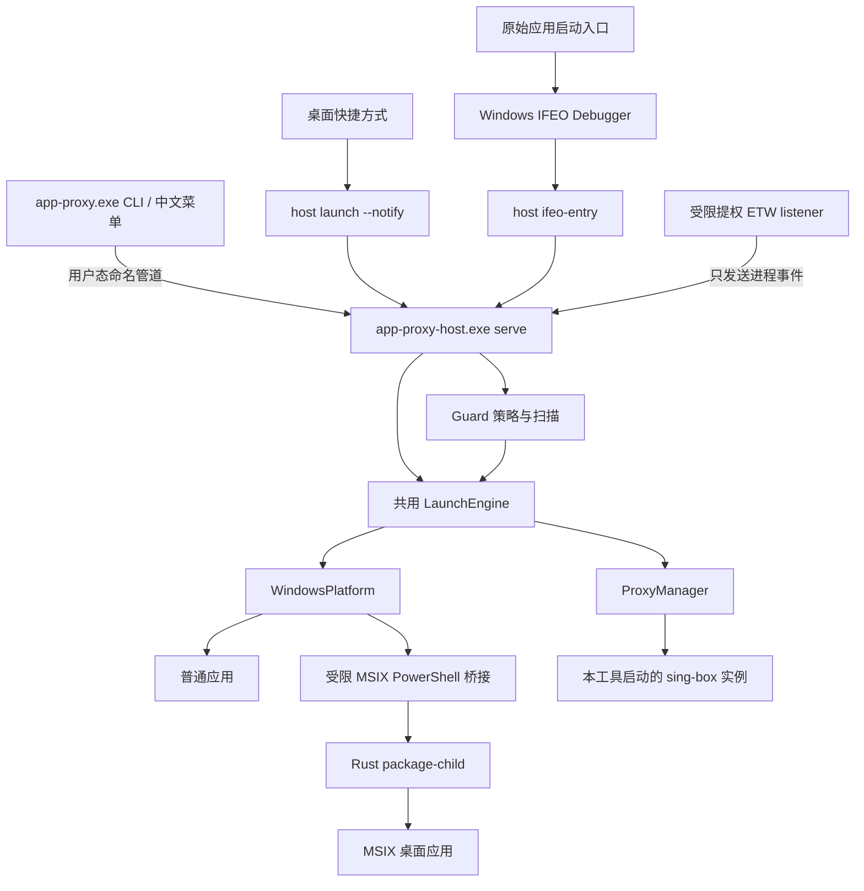

**架构与范围**

本设计选择一个用户态协调进程管理一个 store，一套 Rust 核心服务所有入口。状态机、配置校验、代理准备和实例识别不在 CLI、Guard、未来 GUI 中重复实现。

**1. 首版交付范围**

Windows x64 普通 EXE、登记为 full-trust 的 MSIX 桌面应用；Codex/Claude 原版和空白分身；通用环境变量/已确认 Chromium 代理适配；自行启动并托管 sing-box，支持程序文件发现与一键安装；六类订阅协议和手动 HTTP/SOCKS5 上游；快捷方式；ETW Guard 及授权后监听失效时的扫描兜底；诊断、全新初始化和本产品入口维护。

GUI、macOS 平台实现、任意 AppContainer、网络驱动强制代理、任意应用自动多开、账户状态复制、用户脚本插件和默认代理继承不进入首版。后两项有数据模型演进位置，但不实现未使用的功能。旧版本兼容、迁移器、旧命令 alias 和双版本切换明确不做。

不修改目标应用安装内容、签名、ACL、系统代理或系统环境。MSIX 数据目录可能属于应用包 LocalState，原包卸载/重置可能清除它；界面在实例详情中显示实际归属。

IFEO 启动前接管属于 Guard，Codex/Claude 已登记且开启 Guard 的原版默认使用它；与 ETW 检查一起构成保护流程。只创建分身时不安装该 EXE 的 IFEO，不接管未管理原版；分身通过专用启动入口及针对实例的检查保护。默认开启表示期望状态，系统注册仍需前台授权，实际支持必须逐应用验收。它需要修改机器级 IFEO 注册项；上述不修改目标安装内容的约束不等于不写系统集成注册。机器级影响、防递归、子进程及 MSIX 边界见 [09-ifeo-launch-interception.md](D:/app_proxy/rust/docs/09-ifeo-launch-interception.md)。

**2. 进程拓扑**



`app-proxy.exe` 是控制台入口，负责参数解析、中文菜单和结构化输出。`app-proxy-host.exe` 使用 Windows GUI subsystem，承担隐藏快捷方式入口、serve、package-child、ifeo-entry 和 events-listen 模式；共享库实现业务，二进制没有第二份逻辑。

提权 ETW listener 使用安装到受管理员保护目录的 host 副本。检测到高完整性令牌时，只允许事件监听及固定安装维护模式，拒绝 serve、launch、package-child、ifeo-entry 和任意执行命令。目标应用始终由普通权限进程启动。初始提升运行的用户也不能绕过这项检查，需使用普通入口。IFEO 注册安装/解除属于固定维护模式；高权限运行目标不在首版 IFEO 支持范围内。

一个 store 在一个 Windows 用户下只允许一个 coordinator，首版只支持它所属的一个交互 session。第二个 session 打开同一 store 返回 `STORE_SESSION_CONFLICT`；另一会话需要独立 store。这是首版产品限制，不依赖隐藏的跨会话转发。

coordinator 持有 store 独占进程锁和写入权限。启动采用“尝试连接 → 竞争 store 启动锁 → 再连接 → 启动 host → 等待 ready”，失败者连接胜者，不继续生成副本。serve 协议版本不匹配时返回明确错误，不杀掉旧进程。

没有 Guard、运行实例、待确认启动、托管内核或事务时，空闲 30 秒后退出。存在上述任一资源时继续运行。退出 UI 不停止应用；coordinator 异常退出也不通过 Job Object 连带杀掉用户应用。

**3. 计划中的代码目录**

以下为目标实现结构；当前 M0 实现范围以 [验证记录](D:/app_proxy/rust/TEST-RESULTS.md) 为准，不提前建立所有子模块。

```text
rust/
  Cargo.toml / Cargo.lock / rust-toolchain.toml
  crates/
    app-proxy-core/src/
      model/ template/ storage/ launch/ guard/ proxy/ subscription/ protocol/
    app-proxy-windows/src/
      process/ package/ identity/ paths/ ipc/ etw/ tasks/ shortcuts/ ifeo/
    app-proxy-app/src/
      bin/app-proxy.rs
      bin/app-proxy-host.rs
      menu/ commands/ coordinator/ install/
  assets/msix-bridge.ps1
  tests/fixtures/ tests/contract/ tests/windows/
  docs/ examples/
```

`app-proxy-core` 定义领域模型、流程和平台接口，不依赖 Windows 类型。`app-proxy-windows` 依赖 core，实现接口并封装 FFI。app 依赖两者，负责组装、命令入口及版本信息。先采用这三个 crate，不把每个功能拆成独立 crate。

**4. 组件契约**

| 组件 | 输入与输出 | 不负责 |
|---|---|---|
| TemplateRegistry | 模板 ID + 安装描述 → 能力、受管参数、环境变更 | 网络请求、修改系统设置 |
| InstallationResolver | EXE locator / 包身份 → 当前可执行文件、包版本、文件身份 | 决定用户要哪份实例数据 |
| InstanceRegistry | 创建/更新请求 + revision → 持久化实例记录 | 创建目标应用进程 |
| LaunchEngine | instance ID + request ID → attempt + 事件/结果 | UI、UAC 弹窗 |
| ProcessPlatform | spawn/inspect/stop/observe → 带证据的身份和结果 | 判断某个代理应绑定给谁 |
| PackageLauncher | validated plan + attempt capability → 包内回执 | 接受任意 shell 字符串 |
| ProxyManager | profile ID + revision → ProxyLease / 失败 | 修改外部 sing-box |
| GuardController | 进程事件/定时扫描 + 配置 → 纠正意图 | 第二套启动实现 |
| IfeoIntegration / IfeoEntry | 注册安装/核验及受限启动输入 → 集成状态 / InterceptRequest | 第二套代理逻辑、按 EXE 名猜实例、任意提权执行 |
| Store | 带期望 revision 的变更 → 新 revision / 冲突 | 等待网络、提权或应用退出 |

表中组件表示职责边界，不要求每项都建立 trait、注册器或独立服务。内部业务优先使用普通函数和结构体；进程、网络、存储等确有替换测试需要的外部边界再用小接口。阻塞的 COM/WMI 调用在专用线程中执行，ETW 消费在线程中阻塞，均不阻塞异步任务执行器。取消异步等待不等于取消底层系统操作，后续章节规定迟到结果处理。

**5. 依赖选择**

| 用途 | 方案 | 约束 |
|---|---|---|
| 异步调度、计时、网络及管道 | Tokio；需要时使用 tokio-util 取消原语 | 小规模固定线程池；禁止无界事件队列 |
| Windows API | windows-rs 家族，按 API/feature 选择绑定 | `unsafe` 限定在平台 crate；用 RAII 封装句柄 |
| JSON 模型和存储 | serde / serde_json | enum tagged encoding；未知 schema 拒绝写入 |
| CLI | clap | 参数数组作为数组处理，不拼 shell |
| HTTP | reqwest，显式代理/直连策略 | TLS 校验、重定向、响应大小和超时统一封装 |
| 错误/日志 | thiserror + tracing | 面向用户错误稳定；禁止秘密字段 Debug 输出 |
| ID、摘要 | uuid + sha2 | store/instance/attempt 分别有身份 |
| 订阅语法 | 先结构化解析中间模型；YAML 库在技术验证时选型 | 按维护状态和语法需求选型；不执行用户配置 |

版本与 MSRV 在 M0 的依赖解析及 Windows 构建通过后写入 lockfile/toolchain；设计阶段不捏造已可编译的版本组合。Rust 原生分发可以移除 Node。发行包不携带 sing-box；运行时发现已有程序文件或提供一键安装，内核所需 DLL 与 MSIX 系统 PowerShell 仍属于外部运行依赖。

官方依据：[windows-rs](https://github.com/microsoft/windows-rs)、[Windows CommandExt](https://doc.rust-lang.org/std/os/windows/process/trait.CommandExt.html)、[Tokio shutdown](https://tokio.rs/tokio/topics/shutdown)。这些提供接口和任务机制；正确取消与资源所有权仍由本设计实现。

**6. 决策后果**

coordinator 多一个轻量常驻进程，但消除了各入口长期竞争全局锁、各自启动内核与分散恢复的复杂性。采用 supervisor 风格的内部任务组织；一个实例失败不导致整个 coordinator 退出。

产品主业务只在 Rust 内维护。首版 PowerShell 仅负责经测试的 Appx 查询/包上下文激活，可在原生替代通过相同契约测试后删除；它不承载代理配置、实例状态或 Guard 决策。
