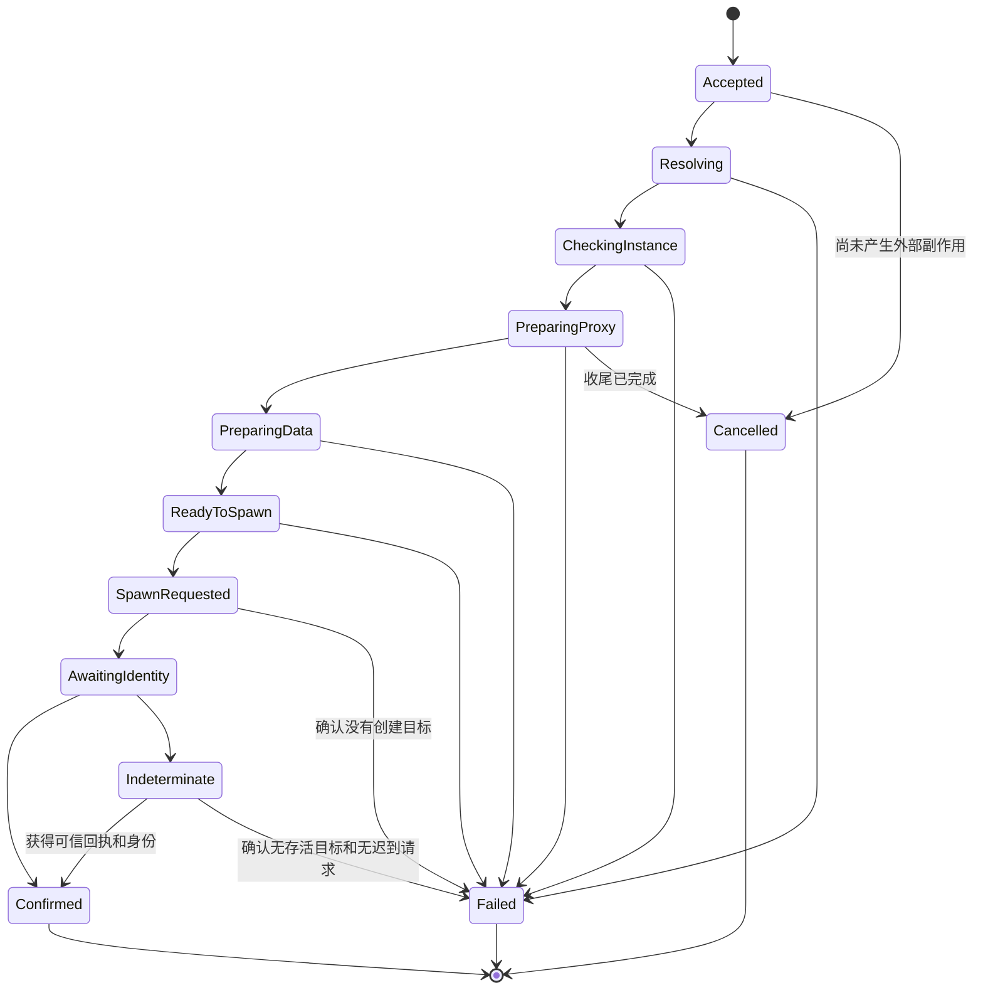

**启动、并发和 Guard**

CLI、快捷方式、IFEO 主进程接管和 Guard 均向 coordinator 提交意图；LaunchEngine 是唯一生产实例启动流程。外部启动事件只触发检查，不直接授权终止进程。

Guard 包含 IFEO 启动前接管和 ETW 进程创建后检查，Codex/Claude 代理预设默认启用这套保护；组件实际状态分别展示，不作为两个无关产品开关。所有来源的最终 spawn 都必须识别已安装 IFEO 规则并使用经验证的防递归机制。IFEO 辅助进程 continuation 不创建新的实例 attempt；Guard 排除已核验的内部创建状态，不能因暂未确认参数而二次纠正。详见 [第九章](D:/app_proxy/rust/docs/09-ifeo-launch-interception.md)。

Guard 仅保护已登记并启用的实例。IFEO 注册由已登记原版的 Guard 驱动；只登记分身时不注册 IFEO，ETW 扫描发现未管理原版也不采取动作。未管理不是 unknown 或失败，不要求用户补配原版。分身按已登记的独立数据目录及完整身份识别，不能按同名 EXE 扩大纠正范围。

**1. 一次启动的状态机**

图示只列主要转移；Resolving/CheckingInstance/PreparingData/ReadyToSpawn 也可在完成本阶段清理后取消。进程创建之后不能使用“Cancelled”暗示应用没有启动。Confirmed 是本次启动确认完成，后续运行状态由 RunningSession 跟踪为 running/exited/unknown，与网络证据维度分离。

| 阶段 | 工作 | 失败或退出处理 |
|---|---|---|
| Accepted | request-id 去重、创建 attempt、实例预留 | 同 request-id 返回同 attempt；新请求指向同一未决实例则返回已有 attempt |
| Resolving | 解析安装/包身份、模板、数据映射 | 不存在或能力不符则失败；无目标进程副作用 |
| CheckingInstance | 核对当前进程、跨 store 资源 key | 已有匹配进程返回 AlreadyRunning，不能向旧进程注入新设置 |
| PreparingProxy | 获得目标 profile lease，准备和真实联网验证 | 失败终止本次启动，不降级直连 |
| PreparingData | 校验归属、分配目录、构造 env/argv/cwd | 只清理本次临时对象；保留用户目录 |
| ReadyToSpawn | 复核依赖 revision、包版本、存储身份和进程状态 | 有变化则有限重新准备或返回 CONFIG_CHANGED |
| SpawnRequested | 持久化启动 intent，再调用平台创建 | 明确未创建才 Failed；可能已创建则 Indeterminate |
| AwaitingIdentity | 等待回执、持有并校验进程句柄/创建时间 | 不凭同名进程认领；不盲目重试 |
| Confirmed | 写 RunningSession、记录实际代理快照 | 仍不声称应用所有网络请求经过代理 |

“AlreadyRunning”是可显示的幂等结果，只有保存的实际绑定与当前请求一致且身份已确认才可报告匹配；不一致显示“正在使用另一份启动配置，请先退出”。原版之外的不同数据目录实例可以共存。

**2. 时间和取消契约**

以下为初始设计预算，不是当前测得性能：IPC 握手 5 秒；安装解析/进程检查各 5 秒；单次 HTTPS 探测 10 秒；普通进程确认 3 秒；MSIX request TTL 20 秒、前台等待至 22 秒；完整启动通常预算 90 秒。缺内核下载单独进入可取消 install operation，给出进度和更长上限，不能隐含无限延长 launch。

阶段使用单调时钟预算；跨进程落盘 deadline 使用 UTC + request epoch，helper 同时限制自收到请求后的最大时长。系统时间明显回跳时请求失效并进入核对，不能延长执行授权。必要的存储/平台检查本身有界；超时的阻塞 API 返回后由 epoch 判定是否还能提交。

客户端断开不会等同用户取消，重新连接可以按 request-id 查结果。显式 cancel 在 SpawnRequested 之前停止后续阶段并等待本次资源收尾；之后只标记 cancel_requested 并核对结果，默认不自动终止已成功启动的用户应用。需要关闭应用时使用单独的显式 stop 请求。

Rust Drop 用于同步句柄释放；异步关闭内核、写 journal、停止 listener 必须在显式收尾任务中 await。超时、panic/进程崩溃不能靠析构保证完整清理，需下一次恢复。

**3. 并发模型**

coordinator 对 manifest/runtime 的提交串行化，网络、下载、包查询在锁外执行。使用三类互斥：

| 资源 | 范围 | 持有时间 |
|---|---|---|
| Instance reservation | 本次 store + instance key；跨 store 用户级 Windows 内核文件锁防同一物理实例竞争 | 执行期间持有锁；确认后由持久化完整进程身份继续占用资源 |
| ManagedCore gate | 每个 store 的共享 sing-box generation | 配置/启动/停止操作串行；运行期间不持有长配置锁 |
| State commit gate | manifest/runtime 短事务 | 仅校验 revision、原子写和状态转换 |

锁顺序为 instance reservation → core gate → state commit；任何持有 state commit 的代码都不得等待其他锁、网络、进程退出或 UAC。进程启动预留与真正运行身份分别保存，不能把 stale lock 文件当作进程活着。

多实例可同时做只读解析，但共享内核更新被 core gate 串行。UI 改名称不使整个 LaunchPlan 失效；比较应用定位、模板、参数、数据和代理等依赖 fingerprint/revision。影响启动的变更最多重新准备一次，连续变化返回 CONFIG_CHANGED，避免无穷循环。

代理更新与启动间存在 generation race。ReadyToSpawn 从 core manager 获得启动许可，至身份确认前阻止同内核 destructive reconfigure；不持有 state commit 等回执。许可带 attempt deadline 和恢复状态，MSIX 结果未定不能仅因客户端超时立即释放。已有运行会话使用的端口被改掉会影响流量，proxy edit 必须明确列出影响并让用户显式应用，见代理设计。

跨 store 文件锁只约束本 Rust 产品，不控制其他启动器。外部手动启动仍需立即复查及 Guard，不能完全消除竞态；外部已存在实例按资源占用处理，不自动接管。

用户级预留自动存放在 Windows LocalAppData 下的 `AppProxyRustResources`，独立于各配置目录。目录先完成归属标记和 ACL 再发布；资源 key 包含用户/会话、EXE 文件身份或稳定包定位，以及原版标记或分身目录的物理身份，不使用显示名称。锁可以跨执行线程移动，进程退出会释放内核锁，但不会删除持久占用记录。未知记录不能靠重新取得锁、等待超时或 Drop 清除。

本地 `ReadyToSpawn → SpawnRequested` 原子写入随机 dispatch nonce，并且只发出一次不可复制的执行许可。跨 store 预留核对完整 store/attempt/epoch 和绑定后，消费此许可并持久化全局启动 intent，平台创建只能消费之后的授权对象。确认成功时先保存全局完整身份，再保存本地 Confirmed；只有平台明确没有创建进程的证据，且完整 owner 与 nonce 都匹配，才能结束为 Failed 并释放占用。创建成功之后的身份读取、调试脱离或回执失败一律保留未知，不能用后续另一次失败尝试证明旧目标不存在。Confirmed 的释放必须只读核对精确进程已经退出。

普通 EXE 服务实现补充：dispatch 前持同一 store 锁恢复已接受的配置请求，再复核依赖摘要并写启动 intent。全局 Confirmed 在本地确认落盘后还需写同步 ACK；没有 ACK 时即使应用退出也不能被另一 store 覆盖，以便原 owner 补回执。本地确定未创建及准备释放失败的记录，在全局占用同步完成前不按普通终态过期清理。恢复仅核对受保护的 owner/epoch/nonce/物理绑定与已保存结果，不重放创建。取得独占资源锁后，同 store 的 Reserved（没有 dispatch nonce）若旧准备记录已过期，仍可释放后交给新 owner；旧执行许可不能通过新 owner 的授权核对。

当前执行模块仅处理普通 EXE，已接 coordinator RPC 与启动 CLI，菜单待接入；MSIX 和存在 IFEO Debugger 的程序返回明确待支持错误，避免绕过对应平台流程。包启动请求平台模块已提供一次发布/消费、撤销和回执，生产执行链仍待接入。启动前的占用扫描能拒绝已识别的外部进程，并不提供对任意外部启动者的原子排他保证。

coordinator 与启动服务共用同一个 CoreManager，受理后由服务持有任务，客户端断开不取消。任务完成通知及 5 秒只读维护核对已有会话退出；无法核对时保活，不将其当作已退出。历史登录会话仅能通过受保护记录进行同用户的只读核对和回执同步；创建、终止及普通资源预留仍限当前会话，不因会话号不同就推断旧进程已退出。

**4. 崩溃恢复与未知结果**

serve 启动后先获得 store 独占锁，完成 schema/归属校验和 journal reconciliation，再报告 ready。逐项检查：

- Accepted 至 ReadyToSpawn：无已创建证据时释放意图，但先确认没有 MSIX request 和外部副作用。
- SpawnRequested/AwaitingIdentity：查询 request 消费状态、回执、进程和创建时间；可确认则恢复 session，否则进入 Indeterminate。
- Confirmed：重开进程句柄并匹配身份，存活才恢复 running；PID 被复用视为已退出。
- 核心 generation 切换：按 active journal 和真实 core 身份恢复，不能从端口开放推断是自有内核。

普通 EXE 在“系统创建成功、receipt 尚未写入”间崩溃同样可能未定。精确匹配实例目录可以辅助确认；多个候选或命令行不可读时维持 unknown，要求用户确认关闭相关实例后再尝试。不得用过期时间自动证明目标不存在。

日志不足以证明实例安全可重启。Indeterminate 始终占用实例预留；MSIX helper 的执行能力被撤销且进程扫描确认无匹配实例，才允许清理未决状态。人工解除未决也是显式操作，不能仅删除 pending 文件。

**5. Guard 策略**

首版只定义 `stop_unproxied`：发现同用户、同 session、同安装与同实例的主进程，没有要求的代理参数或存在冲突参数时，关闭该精确进程；代理和环境准备成功后重启。代理不可用时保持关闭并报告 `GUARD_STOPPED_PROXY_UNAVAILABLE`，不回退直连。

已按要求启动的应用随后遇到代理故障，仅报告网络异常并保留应用，不触发 stop_unproxied，不自动改直连。关闭未按要求代理的误启动进程与运行中网络故障是两种不同事件；新的启动仍需代理验证通过。

流程：ETW 提示或周期扫描 → 读取配置快照 → 实例归属和参数判断 → 检查限流及预留 → 重新验证身份 → 正常关闭 → 必要时精确终止 → 确认辅助进程消退 → 提交共用 LaunchEngine → 记录结果。可在关闭前做轻量配置检查，但不等待完整网络准备而扩大已知直连窗口。若检查已知代理不可用，仍按 stop_unproxied 关闭，并终止重启阶段。

这是对现有保护意图的明确化，不解决网络层第一包泄漏；事件在创建之后发生。未来如要“能重启才替换”，必须添加单独 policy 并说明其保留直连的行为，不能暗改默认策略。

保持以下规则：

- helper/crashpad 不作为纠正主目标；只通过已验证的同实例祖先归属它们，无法证明则不杀。
- 进程参数空或不可读是 unknown，不是“缺代理”；短暂延迟后最多三次核对，仍不清楚则诊断。
- PID、创建时间、用户、会话、image 与实例归属全部复核；正常关闭等待 1.5 秒，必要时使用已核验的同一进程句柄终止，之后最多等 3 秒。
- 启动中和 MSIX 未决实例不进入第二次纠正；辅助进程残留时不强行再拉起。
- 每实例 5 秒冷却、滚动一分钟最多 3 次；将近期实际 stop/relaunch 尝试保存在 state，coordinator 重启后仍限流。时间回跳采用保守等待。
- 用户修改绑定后，已确认 running session 的旧绑定仍合法，直到该会话退出；不能把配置新值硬套到旧进程上。
- 卸载一个包只标记该实例 unavailable，继续保护其他实例。

**6. 监听和授权状态**

Guard desired 配置与实际状态分离：disabled、needs_authorization、starting、active、degraded、blocked；组件分别记录 IFEO 状态及监听状态 active_etw/active_polling。Codex/Claude 绑定代理时默认 enabled，原版的前台授权流程包含 IFEO 注册与事件组件；只有分身时仅要求适用的事件检查组件。所需组件安装/检查通过才报告 active；原版需要 IFEO 而未就绪时报告 degraded。只管理分身时 IFEO 为 not_applicable，不因此降低保护状态。取消 UAC 保留实例和明确的未完成保护状态，后台不再次弹窗。

ETW listener 验证成功后使用事件触发，并每 30 秒补漏扫描。已授权监听中断/协议不匹配时可退回约 2 秒扫描，30 秒尝试恢复；未知提权组件版本只报告需更新，不自动覆盖。所有时序是初始设置，需通过实机测量后确认。

单次事件不是权威进程身份。消息队列上限 1024 个，重复 PID/name 合并；溢出设置 full_scan_required 并记录计数，不丢事件后继续声称已完整覆盖。订阅/回放事件不包含全量命令行或网络载荷。

**7. 所有权与停止规则**

| 资源 | 所有者 | 失败/退出时行为 |
|---|---|---|
| 用户应用 | 用户；launcher 仅持有管理身份 | UI 退出不杀；Guard 或显式 stop 才按身份关闭 |
| 分身目录 | 对应实例的数据 | 启动失败、取消、移除登记都默认保留 |
| 本次 helper/request | attempt | 撤销执行能力、核对回执后清理 |
| 托管 sing-box | store core manager | 不随单个实例退出自动停止；显式 stop/reconfigure 才处理 |
| 其他工具运行的 sing-box | 原有启动器 | 不作为本产品代理入口；不接入、kill、restart 或重写配置 |
| ETW session/listener | 已授权安装和当前用户/session | 仅维护自有命名空间；停止前校验归属 |
| IFEO 注册及受保护入口 | 受管原版的 Guard，机器级安装清单记录所有者 | UI/协调进程退出不撤销；关闭或移除原版保护时解除，分身不要求保留它；保留第三方规则 |

用 typed lease 表达所有权，单个 launch 的清理只释放其 lease。共享内核暂时无人使用也不在析构中自动关闭，以保持当前行为并避免干扰刚启动或外部复用本地入口的应用。
