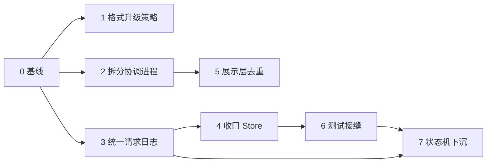

**重构计划**

状态：2026-09-21 起草，基线为分支 `codex/entry-maintenance` 的提交 `5adc708`。本文只规划代码组织方式的调整，不改变产品范围和已确认的安全设计。每个阶段单独评审、单独提交，可以随时停在任意阶段之间。进度记录在本文末尾的表格里。

**1. 现状**

进程模型：每个 Windows 用户的每个 store 只有一个普通权限协调进程，独占配置写入。CLI、中文菜单和快捷方式入口都是客户端，通过用户态命名管道发请求。提权监听组件只上报进程事件，不接收控制命令。目标应用始终由普通权限进程启动。这一层与 [01-architecture.md](01-architecture.md) 一致，不在重构范围内。

代码规模（不含测试文件的生产代码行数，2026-09-21 统计）：

| crate | 行数 | 设计定位 | 实际内容 |
|---|---|---|---|
| app-proxy-core | 约 4300 | 领域模型、流程、平台接口 | 模型、校验、订阅解析、sing-box 配置生成；无 IO，禁用 unsafe |
| app-proxy-windows | 约 19800 | 封装 Win32 | 37 个平铺模块；Win32 封装之外还有存储、五套请求日志和多个状态机 |
| app-proxy-app | 约 16700 | 组装与入口 | 协调进程、启动引擎、内核管理、Guard 监控、8 个 CLI 模块和菜单 |
| app-proxy-setup | 约 600 | 安装器 | 载荷嵌入、文件事务、回滚 |

已经确认的结构问题，按影响排序：

| 编号 | 问题 | 证据 |
|---|---|---|
| A | 持久化格式没有升级路径 | manifest 只接受 `schema_version == 1`（`core/src/model.rs:330`）；全工作区 146 处 `deny_unknown_fields`；已经在用 `serde(default)` 加字段而不升版本；约 12 种状态文件各自硬编码版本判断 |
| B | 分层与设计文档脱节 | 设计把 storage、launch、guard、proxy 放在 core；实际 `core_update.rs`、`launch_state.rs`、`config_transaction.rs`、`core_requests.rs`、`subscription_stage.rs` 等基本不含 Win32 调用的状态机都在 windows crate；全工作区没有生产用 trait，没有时钟接缝 |
| C | `Store` 是上帝对象 | `impl Store` 分布在 15 个文件，约 115 个公开方法；五套请求日志互查 ID 冲突（同一段四路判断复制在五处）；`store.rs` 反向调用 `config_transaction`、`core_update`、`shortcuts`；应用层 12 个文件共约百处直接取裸 `MutexGuard<Store>` |
| D | 五套请求日志各自手写 | `now()` 复制 6 份，七天保留期常量 5 份，“缺文件返回空、校验、写回”流程 3 份，容量预留 2 份 |
| E | `coordinator.rs` 一个文件三种角色 | 2300 行；协议类型、服务端分发、约 25 个客户端函数混在一起；`handle()` 约 400 行；分发做两遍；22 处小版本门控；每次客户端操作先做一次状态往返，一个请求两次管道连接 |
| F | 展示与编排没有分开 | 菜单通过构造 clap 命令对象并传 `json=false` 复用 CLI 流程；共享函数同时发请求、打印、选退出码；`guard_cli::run_with_foreground` 单函数约 375 行；Guard 阶段到中文的映射写了三遍 |
| G | 测试接缝靠条件编译 | `LaunchEngine` 有 8 个 `#[cfg(test)]` 钩子字段，`launch_engine.rs` 共 28 处 `cfg(test)`；`Shared::new` 按 `cfg(test)` 分叉构造；引擎测试创建真实进程；进程查询用进程级全局单槽位（`windows/src/process_query.rs:38`），测试必须 `--test-threads=1` |
| H | 异步与阻塞互相嵌套 | 5 处 `spawn_blocking` 内再 `block_on`；“持有 store 锁期间不 await”只靠约定，编译器不检查 |
| I | 错误码仍是散落的字面量 | 第一步已完成（见第 6 节）；应用层约 300 个、平台层约 420 个不同字面量仍无常量表；调用方按字面量匹配约 15 个错误码 |
| J | 平台层重复的 FFI 封装 | COM 公寓守卫 4 份，安全描述符封装和 `sid_string` 各 3 份，`com_error` 3 份 |
| K | 命名冲突与模块平铺 | `setup` 三处、`shortcuts` 两处、`core_control` 两处；`installation.rs` 实际是“被管理应用的安装解析”；windows crate 37 个模块没有分组 |
| L | 文档与工程卫生 | 无 CI；`rust/README.md` 和多份文档用 `D:/app_proxy/...` 绝对链接；文档索引停在 09；编号有两个 08、两个 12、缺 17；61 处引用被 gitignore 的 `.tools/` 证据 |

**2. 必须保持的不变量**

下列性质是本项目的核心价值。任何阶段的改动如果影响到它们，必须在提交说明里写明并单独评审。

1. 写请求先持久化编号再执行；同编号只回放历史结果，不重复执行；载荷不同的同编号被拒绝。
2. 结果不明时保留“未知”，不伪装成失败，不自动重试。
3. 客户端断开不取消已接受的工作；协调进程有未决工作时不空闲退出。
4. PID 不构成授权。启动和停止必须持有许可类型，Guard 停止返回回执。
5. 秘密不进 Debug 输出、manifest、请求记录和线上错误。
6. `unsafe` 只出现在 windows crate；core 和 app 保持 `forbid(unsafe_code)`。
7. 提权进程只监听事件和执行固定的安装维护，不启动、不终止应用。
8. 坏配置、未知目录、用户修改过的文件一律保留并报告，不重置、不覆盖。

**3. 目标**

每条目标都可以用命令或代码检索验证。

| 编号 | 目标 | 验证方式 |
|---|---|---|
| T1 | 新版程序能读旧版配置；旧版程序遇到新版配置给出明确错误并保持文件不变 | 夹具测试：历史版本 manifest 样本必须能加载；高版本样本返回固定错误码 |
| T2 | 新增一种持久请求只需要改一处登记 | 检索：ID 冲突判断只出现一次 |
| T3 | 协议、服务端、客户端分属不同文件；每个操作的执行类别在一处声明；没有小版本判断 | 文件结构；`handle()` 不超过 100 行 |
| T4 | CLI 与菜单共用一层返回类型化结果的用例函数；该层不打印、不决定退出码 | 检索：用例层没有 `println!`、`eprintln!` 和 `exit::` |
| T5 | 启动引擎的生产结构体里没有 `#[cfg(test)]` 字段；引擎单元测试不创建真实进程 | 检索 `cfg(test)`；测试可并行运行 |
| T6 | 与平台无关的状态机可以在不触碰文件系统的情况下测试 | 这些模块的测试不使用 `tempfile` |
| T7 | 应用层拿不到裸的 `MutexGuard<Store>` | `Configuration::lock` 不再是 `pub(crate)` |
| T8 | 全量默认测试可以并行运行并在干净环境下全部通过 | `cargo test --workspace --locked` 不带 `--test-threads=1` |

**4. 工作方式**

每一步是一个独立提交，遵循仓库现有的提交前缀。除非步骤里明确写了“行为变化”，否则一律是保持行为的移动或抽取。

每个提交前运行：

```powershell
./scripts/cargo.ps1 fmt --all -- --check
./scripts/cargo.ps1 -CargoArgs @('clippy','--workspace','--all-targets','--locked','--','-D','warnings')
./scripts/cargo.ps1 -CargoArgs @('test','--workspace','--locked','--no-fail-fast','--','--test-threads=1')
```

已知基线：在 Claude 桌面应用的会话里运行测试时有 3 个用例失败，未改动的 `dc950f8` 上同样失败。`package_launch::tests::successful_creation_is_once_only_and_late_cancel_preserves_exact_child` 的原因是子进程继承了宿主的 MSIX 包身份。`process_contract` 的两个用例表现为探针超时，原因推测相同，尚未单独验证。阶段 0 处理这件事。

移动代码时先移动、后修改，分成两个提交，方便评审时用 `git diff --color-moved` 核对。

涉及持久化格式、线上协议或退出码的改动，同时更新对应设计文档的章节。

**5. 阶段**

规模标记：S 指一两个提交，M 指一组约五到十个提交，L 指需要再拆子计划。

**阶段 0：基线与护栏（S）**

目的是让后续每一步都有可信的回归信号。

| 步骤 | 内容 |
|---|---|
| 0.1 | 新增 `scripts/verify.ps1`，按固定顺序执行第 4 节的三条命令，返回非零即失败 |
| 0.2 | 在普通终端复跑 3 个基线失败用例，确认原因。若确因宿主包身份，让这些测试在检测到当前进程有包身份时输出跳过原因并返回，而不是失败 |
| 0.3 | 文档链接改为相对路径；`rust/README.md` 的文档索引补到当前编号；决策日志类文档（08 之后带日期的各篇）移入 `docs/decisions/`，保留 01 到 09 加 16 为常设设计文档 |
| 0.4 | 增加 CI 配置：Windows 上运行 fmt、clippy、默认测试和打包冒烟。仓库目前没有远端流水线，是否启用由维护者决定；脚本先行 |

验收：`verify.ps1` 在普通终端全绿。

**阶段 1：持久化格式的升级策略（M，发布前必须完成）**

先把现有持久化内容分成三类，分别定规则。

| 类别 | 内容 | 规则 |
|---|---|---|
| 长期配置 | `manifest.json`、秘密文件、保存的订阅文档、实例数据标记、资源占用标记、安装记录 | 必须可迁移。新版读旧版；旧版遇到新版报固定错误并保持原文件 |
| 短期记录 | 配置请求、内核请求、启动日志、快捷方式日志、登录任务日志、内核更新计划、内核启动凭证、监听安装计划 | 终态保留七天，未决记录保留到处理。升级前由安装器等待协调进程排空；版本不符的记录保留原文件并报告，不删除、不猜测 |
| 线上格式 | 协调进程 IPC、事件管道、UAC ticket、MSIX 请求文件 | 前后台成套发行，不做跨版本兼容；版本不符明确拒绝 |

| 步骤 | 内容 |
|---|---|
| 1.1 | 把上表写入 [02-model-and-storage.md](02-model-and-storage.md)，并列出每种文件的当前版本号和所在代码位置 |
| 1.2 | core 增加 manifest 的两段式加载：先只读 `format` 和 `schema_version`，再按版本分派。高于当前版本返回 `STORE_SCHEMA_NEWER`；低于当前版本依次经过迁移函数。v1 到 v1 是恒等，先把通道建起来 |
| 1.3 | 增加历史样本夹具目录。每次升版本时把上一版的样本固化进去；测试要求所有历史样本都能加载并通过校验 |
| 1.4 | 定规则并用测试固定：给长期配置加字段必须升 `schema_version`。用一个对 `Manifest::bootstrap` 序列化结果的快照测试发现未升版本的字段变化 |
| 1.5 | 核查后不改代码：11 处短期记录的版本判断都已经是“返回错误并保留原文件”，没有任何一处删除或重置。收拢成辅助函数只会改变错误码。规则和清单写入文档 |
| 1.6 | 安装器文件名常量移入 `app_proxy_windows::setup` 供两侧共用；启动闸门改用只含 `published` 的类型读取，并有意保留对未知字段的宽容，让旧程序能识别新安装器的日志。完整的 `Journal` 类型仍留在安装器 crate |
| 1.7 | `package.ps1` 的版本号改为读取工作区版本 |

行为变化：1.2 新增错误码 `STORE_SCHEMA_NEWER`。执行中另外发现并修复一处问题：store 的归属标记复用了 manifest 的 `SCHEMA_VERSION`，而标记只在初始化时写一次，manifest 一升版本就会让所有已有 store 以 `STORE_HEADER_MISMATCH` 打不开。标记现在有独立的版本号。

验收：目标 T1。

**阶段 2：拆分协调进程模块（M）**

纯移动为主。先拆文件，再整理分发。

| 步骤 | 内容 |
|---|---|
| 2.1 | `coordinator/protocol.rs`：`Hello`、`Welcome`、`Request`、`Operation`（27 个变体）、`Response`、`Reply`、版本常量、`safe_error` 和 `remote_error` |
| 2.2 | `coordinator/client.rs`：`rpc`、`client_operation`、约 25 个公开客户端函数、`status` 和引导启动逻辑 |
| 2.3 | `coordinator/server.rs`：`Shared`、`serve*`、`handle`、`execute`、`JobCompletion`。对外路径通过 `pub use` 保持不变，调用方不用改 |
| 2.4 | 已决定（2026-09-21）：删除小版本门控。前后台成套发行，安装器保证成套替换，门控防的场景在正常使用中不出现。去掉 `protocol_minor` 字段和两侧共 22 处判断及其专用错误码，协议大版本升为 4；此后任何协议变化都升大版本，版本不一致一律在握手时拒绝 |
| 2.5 | 已完成：`handle()` 拆成握手、按执行类别路由（有界观察、先准入再回复的持久工作、阻塞的 store 操作）和一次统一回复，由约 290 行降到 60 行。`execute()` 里四个不会到达的变体合并为一个分支；没有为此再复制一份操作枚举，所以不是类型层面的不可达 |
| 2.6 | 已完成：评估确认状态往返只承担“发现并按需启动协调进程”。客户端现在先用 store 标识直接发送请求，只有在管道打开阶段超时（此时请求确定尚未发出）才走发现与启动流程，再发送同一个请求。常见情况下一次操作只建一个连接 |

行为变化：2.4 改变线上握手格式和大版本号，删除 `*_PROTOCOL_UPDATE_REQUIRED` 错误码；同步更新 [06-product-and-protocol.md](06-product-and-protocol.md) 和 `rust/README.md` 里的协议版本说明。

验收：目标 T3；除版本断言外，契约测试全部通过且无需修改。

**阶段 3：统一请求日志（M）**

| 步骤 | 内容 |
|---|---|
| 3.1 | windows crate 内新增 `journal` 模块，提供时钟函数和保留期常量，替换 6 份 `now()` 和 5 份常量 |
| 3.2 | 抽出 `RecordDir<T>`：一请求一文件的目录。覆盖 `config_transaction` 和 `core_requests` 共有的目录固定、UUID 文件名解析、跳过 `.tmp`、过期清理 |
| 3.3 | 抽出 `JournalFile<T>`：单文件日志。覆盖 `shortcuts/journal`、`guard_task/login/journal`、`launch_state` 共有的“缺文件返回空、校验、有界替换写回、容量预留” |
| 3.4 | 新增请求 ID 登记处：每套日志登记一个“此 ID 是否已用”的查询，五处四路判断改为一次调用 |
| 3.5 | 在 3.4 的基础上消除 `store.rs` 对上层模块的反向调用：`Store::open` 和 `commit` 需要的恢复与空闲检查改为通过登记的钩子执行 |
| 3.6 | 平台层 FFI 去重：COM 公寓守卫、安全描述符、`sid_string`、`com_error` 收进内部 `ffi` 模块 |

风险：这些日志是不变量 1 和 2 的实现。每套日志单独迁移、单独提交，迁移前后其原有测试必须原样通过。任何一套迁移后若测试需要修改，停下来评审。

验收：目标 T2。

**阶段 4：收口 Store 的访问面（M）**

| 步骤 | 内容 |
|---|---|
| 4.1 | 盘点应用层约百处 `configuration.lock()` 的用途，按领域归类：配置、内核、启动、快捷方式、登录任务、订阅 |
| 4.2 | 为每个领域在 `Configuration` 上提供一组窄方法，闭包内完成读改写，不把锁守卫交给调用方 |
| 4.3 | 逐个模块迁移，顺序为调用点从少到多：`launch_engine/event.rs`、`shortcuts.rs`、`coordinator`、`core_control.rs`、`login_tasks.rs`、`subscription_preview.rs`、`core_manager.rs`、`launch_engine.rs`、`core_reconfigure.rs` |
| 4.4 | `Configuration::lock` 降为私有 |
| 4.5 | 异步边界：把“在阻塞线程里执行同步 store 操作”收拢成一个辅助函数，5 处 `spawn_blocking` 加 `block_on` 的嵌套逐个替换。替换前先确认每处为什么需要嵌套 |

验收：目标 T7；锁顺序保持“内核闸门在前、store 锁在后”。

**阶段 5：展示层去重（S）**

| 步骤 | 内容 |
|---|---|
| 5.1 | `exit` 旁新增 `cli` 公共模块：JSON 输出函数（现有 4 份 `print`、4 份 `display`）、Guard 阶段和网络绑定的中文标签（现各 3 份和 2 份） |
| 5.2 | 新增 `usecase` 模块。每个用例函数接收类型化输入，返回类型化结果，例如“已保存、已保存但需处理、需确认、结果未确认”。不打印，不决定退出码 |
| 5.3 | 按模块迁移，从小到大：`login_cli`、`shortcut_cli`、`instance_cli`、`proxy_cli`、`core_cli`、`subscription_cli`、`launch_cli`、`guard_cli` |
| 5.4 | 菜单改为直接调用用例层，不再构造 clap 命令对象 |
| 5.5 | `bin/app-proxy.rs` 里重复 9 次的运行时构造收成一个函数 |

已决定（2026-09-21）：暂不做图形界面，本阶段只做 5.1 和 5.5。步骤 5.2 到 5.4 的用例层保留在计划里作为将来的方向，不在本轮执行；目标 T4 相应推迟。

验收：目标 T4。

**阶段 6：测试接缝（M）**

| 步骤 | 内容 |
|---|---|
| 6.1 | 定义小接口 `ProcessPlatform`：创建、查询、停止、观察。生产实现委托给 windows crate 现有函数。[01-architecture.md](01-architecture.md) 第 4 节已经允许在外部边界使用小接口 |
| 6.2 | `LaunchEngine` 通过该接口访问进程。现有 8 个 `cfg(test)` 钩子改由测试用的假平台在对应调用点触发 |
| 6.3 | 进程查询预算从进程级静态量改为随引擎注入的对象；生产环境仍然共享同一个实例 |
| 6.4 | `Shared::new` 去掉 `cfg(test)` 分叉，测试通过构造参数传入测试用资源登记 |
| 6.5 | 保留少量使用真实进程的集成测试并明确标注；其余引擎测试改用假平台，去掉单线程限制 |

验收：目标 T5 和 T8。

**阶段 7：状态机下沉与模块整理（L）**

放在最后，因为它依赖阶段 3 的日志抽象和阶段 6 的接口。

| 步骤 | 内容 |
|---|---|
| 7.1 | 定义受保护文件访问和时钟两个小接口，由 windows crate 实现 |
| 7.2 | 已决定（2026-09-21）：落点为 core，不新建 crate。把不含 Win32 调用的状态机移到 core。候选：`core_update`、`launch_state`、`config_transaction`、`core_requests`、`subscription_stage`、两套 journal 的校验逻辑 |
| 7.3 | windows crate 的模块按领域分组：`store`、`singbox`、`launch`、`process`、`guard`、`shell` |
| 7.4 | 改名消除冲突：`installation.rs` 改为表达“应用安装解析”的名字；三处 `setup` 和两处 `shortcuts`、`core_control` 各自改为能区分职责的名字；安装器的消息框和进度窗口移入 setup crate |
| 7.5 | core 里的 `ProcessIdentity`、`FileIdentity` 从 crate 根移入 `identity` 模块 |
| 7.6 | 更新 [01-architecture.md](01-architecture.md) 第 3 节，使“计划中的代码目录”与实际一致 |

验收：目标 T6。

**6. 已完成**

| 日期 | 提交 | 内容 |
|---|---|---|
| 2026-09-21 | `12a564b` | 问题 I 的第一步。新增 `app-proxy-core::error_code`：结果是否不确定改为查显式登记表，源码扫描测试防止登记表与实际使用漂移。协调进程客户端用 `intern()` 还原线上错误码，删除约 65 项手写白名单。新增 `app-proxy-app::exit`：退出码常量、`Failure` 类型、唯一的错误码到退出码映射 |
| 2026-09-21 | `988812c`、`5adc708` | 移除旧脚本实现及其历史文档；顶层 README 的安装位置改为与代码一致 |

问题 I 的后续：为调用方实际匹配的约 15 个错误码定义具名常量，放进 `error_code` 模块。这一步并入阶段 2，因为这些错误码大多经过协议层。不计划把全部字面量改成枚举。

**7. 顺序与依赖**



阶段 1、2、3 互不依赖，可以按任意顺序进行。阶段 1 有发布期限，其余没有。建议顺序：0、1、2、3、4、6、5、7。

**8. 不做的事**

不更换异步运行时、IPC 方式或存储格式。不把每个功能拆成独立 crate。不为尚不存在的第二个平台预留抽象。不把全部错误码改成枚举。不在重构提交里顺带修功能缺陷；发现的缺陷单独记录、单独提交。

**9. 进度**

| 阶段 | 状态 | 备注 |
|---|---|---|
| 0 基线与护栏 | 完成 | `8c063c3` 至 `5781cff`。3 个基线失败确认是测试进程继承了宿主的 MSIX 包身份，现改为检测到包身份时跳过。CI 配置尚未在真实 runner 上运行过 |
| 1 格式升级策略 | 完成 | `e4250ce`、`784516f`。规则见 [02-model-and-storage.md](02-model-and-storage.md) 第 8 节 |
| 2 拆分协调进程 | 进行中 | 2.4 已完成；2.6 待评估 |
| 3 统一请求日志 | 未开始 | |
| 4 收口 Store | 未开始 | |
| 5 展示层去重 | 未开始 | 只做 5.1、5.5 |
| 6 测试接缝 | 未开始 | |
| 7 状态机下沉 | 未开始 | 落点为 core |
